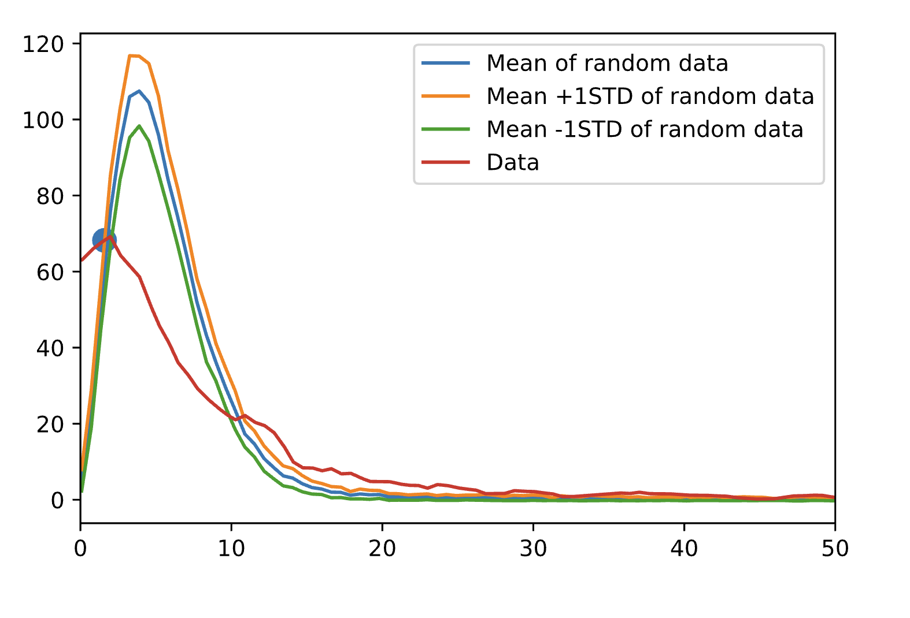

# secondary-crater-removal

[`scia.py`](scia.py) contains a pure Python implementation of [`SCIA.m`](scia.m), Anthony's original MATLAB secondary crater removal script.

## How to run

Python dependencies are managed using pipenv. Install pipenv and install dependencies with `pipenv install`. Then run a shell with `pipenv shell`. Then execute the script: `python scia.py`

## Comparison

The Python script has a very similar output to the MATLAB script.

Python outputs:



```
number of secondary craters:  134
```

MATLAB graph:


```
number of secondary craters:  140
```

## ArcGIS Implementation

### Current flow (using MATLAB)

- Load SHP file with a lot of craters
- Select a small area of craters and export as another SHP file
- Load THEMIS background image
- Run the Create Thiessen Polygons tool in the Analysis toolbox
  - Input features are the detection layer
  - Output fields = ALL
- Polygons now created with attributes (including new diameter_k)
- Right click Layers -> Properties -> Coordinate System -> Choose Mars2000_Equidistant_Cylindrical_clon0 (Anthony will send this)
- In table view -> Add Field
  - Name: area
  - Type: float
- Right click on "area" field and run "Calculate Geometry"
  - Use coordinate system of the data frame
  - Units = square kilometers

This table is now the input to the MATLAB script. Export Table to txt file.

To simulate a random crater population we also need to know the total area of our region of interest.

- Draw a rectangle around the outer limits of the Thiessen polygons on a new layer
- Add a new column to this layer's table called area and calculate the area using the method above

Export this to MATLAB.

Once you have run the simulation and found the threshold size, come back to ArcGIS.

- Go to the Thiessen table, run a select query - "Select by Attributes"
  - query is `"area" <= THRESHOLD_VALUE`
  - click apply
- Right click thiessen layer -> Export data - choose "Export selected" and save as a new shapefile called "thiessen_secondaries". Import the layer into the same map
- Invert selected
- Right click thiessen layer -> Export data - choose "Export selected" and save as a new shapefile called "thiessen_primaries". Import the layer into the same map

Now we want to select all of our Primary craters

- Go to Selection menu -> Select by location
  - Target layer = cda detections
  - Source layer = primary thiessen layer that you just exported
- Now primary craters are selected
- Right click crater layer and go to Data -> export -> choose to export selected and import the new layer back into the same map

Now we want to remove the secondary thiessen polygons from the counting area

- Choose the "Erase" tool from the analysis toolbox
  - Input feature = counting area
  - Erase feature = thiessen_secondaries

### Ideal plugin

User clicks on a tool in a toolbar which opens a tool GUI window.
GUI window has following form inputs:

- crater detection layer
- counting area layer
- output layers:
  - primary crater detections
  - primary counting area
  - secondary crater detections
  - secondary crater area

## TODO

- Mark "output folder" in the ArcGIS tool prompt
- Confirm that the threshold area is +1 sigma from the simulated SFD
- Display the threshold area as a number on the graph

### Additional feedback from Anthony

**Graphing populations**

- Manual approval step for choosing the intersection

**Alert for small crater population**

**Diameter-aware analysis**

Finally, I have received some feedback from several colleagues. They are amazed about our work and the way that we remove the secondaries. However, they conviced me that something is missing in the code: the inclusion of the crater diameter. Since secondaries are clustered but also have a similar diameter within a cluster, we should take into account this in the tool.
Would it be possible to split the simulated crater population and the real population by diameter bin ? I am sure it is and it could improve a lot the efficiency of the tool !
Here is how you can do that:
Create a root 2 diameter bin array: 88.4m, 125m, 177m, 250m, 354m, 500m, 707m, 1km, 1.41km, 2km and so on...
Split the real crater population according to these diameter bins.
Create the Voronoi polygon for each bin.
Simulate a Voronoi tesselation as previously but with the same number of real craters contained in each bin.
The rest of the code remains the same but need to take into account each simulation separately.

- Select by attribute on the CDA layer with the diameter bins
- Run the voronoi polygon steps
- Save the output layer into the output folder as primary, secondary, polygon
- Merge all primary and secondary
- If there are less than 10 craters in a bin, we count all of them as primary
